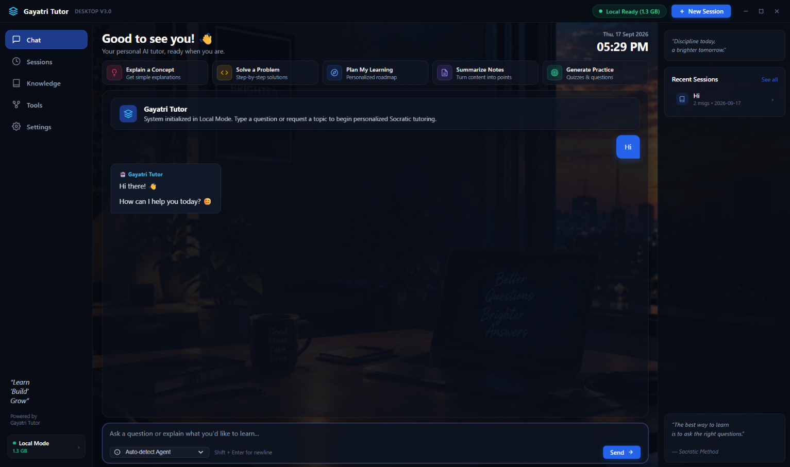

# Gayatri Tutor V3 🎓

> **A Next-Generation, Local-First Agentic AI Platform**  
> *Developed with pride under the [DBERT Internship Program](https://dbert.online)*

Gayatri Tutor V3 is an advanced, local-first desktop application designed to revolutionize personalized learning and AI assistance. By combining a locally-hosted fine-tuned Large Language Model (LLM) with a sophisticated agentic architecture, it provides an intelligent and privacy-controlled learning environment.

This project was built from the ground up to demonstrate how specialized AI agents, orchestrated by a central locally-running brain, can securely tutor students, execute complex tools, and seamlessly bridge local inference with cloud APIs when needed.

---

## ✨ Preview

<p align="center">
  
</p>

> *Gayatri Tutor V3 running in Local Mode — atmospheric dark UI with the Socratic tutoring engine active.*

---

## 🌟 What This Project Does

- **54 Specialized AI Agents:** An ecosystem of agents orchestrated locally:
  - **K-12 STEM Specialists:** Elementary Math, Algebra, Geometry, Physics, Chemistry, Biology, Environmental Science.
  - **Humanities & Language:** History & Civics, Geography, English Grammar Coach, Reading Comprehension, Creative Writing.
  - **Grade-Band Coaches:** Primary School (Grades 1–5), Middle School (Grades 6–8), High School & Board Exam Coach (Grades 9–12).
  - **Pedagogical Support:** Socratic Questioner, Progressive Hint Giver, Doubt Buster, Formula & Theorem Companion, Quiz Master, Study Habit Coach.
  - **Enterprise & Productivity Agents:** Orchestrator, Research, Translation, Document, Summarization, and more.
- **Adaptive K-12 Learning Engine (BKT):**
  - **Course-as-Markdown Ingestion:** Authors create curricula in standard `.md` files with YAML frontmatter, anchored topics `{#topic-id}`, `level:N` paragraphs, and embedded machine-parseable ```` ```quiz ```` blocks.
  - **Diagnostic Placement Testing:** Automated 5–8 question placement test measuring baseline ability across difficulty levels 1–5.
  - **Bayesian Knowledge Tracing (BKT):** Continuous difficulty-weighted mastery updates ($M \in [0.0, 1.0]$) dynamically driving 3-tier pedagogical scaffolding (`Remedial`, `Core`, `Advanced`).
- **Privacy Controlled by Design:**
  - **Local-Only Mode (Default):** All primary inference happens entirely on your local machine using quantized GGUF models.
  - **Cloud-Allowed Mode:** User-approved provider calls may transmit submitted content according to the provider's policy.
- **Native Desktop UI:** Built using PySide6 and a modern WebEngine front-end with SwiftShader software rendering to eliminate GPU artifacts.

---

## 🚀 Getting Started

Follow these steps to set up the project on your local Windows machine.

### Prerequisites
- **Python:** 3.12.x (`>=3.12, <3.13` required for binary wheel and C++ extension compatibility)
- **Git:** Installed and available on system PATH

### 1. Setup the Environment
Clone the repository and run the setup script to configure your virtual environment and install dependencies:
```bash
git clone https://github.com/Gayatri-Education/Gayatri-Tutor-V3.git
cd Gayatri-Tutor-V3
setup.bat
```

### 2. Launch the Application
Once the dependencies are installed and the model is acquired, you can run the application normally:
```bash
launch.bat
```

**Debug Mode:**
If you want to view real-time application logs (useful for checking agent dispatches, model loading, and database queries), use the debug script instead:
```bash
run_gayatri.bat
```
*(Alternatively, you can manually activate the environment and run `python -m app.main` with the `GAYATRI_LOG_LEVEL=DEBUG` environment variable set)*

---

## 📚 K-12 Curriculum & Mastery CLI Tools

### Ingesting & Validating Courses (`scripts/ingest_course.py`)
Authors can drop `.md` curriculum files into `content/courses/` and ingest or validate them using the CLI:

```bash
# Validate a single course file without writing to DB
python scripts/ingest_course.py content/courses/math_g5_fractions.md --validate-only

# Ingest all courses in a directory into SQLite
python scripts/ingest_course.py content/courses/

# Ingest and continuously watch directory for file changes
python scripts/ingest_course.py content/courses/ --watch
```

### Nightly Mastery & Progress Report (`scripts/nightly_mastery_report.py`)
Generate teacher and parent progress rollups with student accuracy %, BKT mastery tiers (`Remedial`, `Core`, `Advanced`), and response times:

```bash
# Generate report for all students (exports both CSV and JSON to data/reports/)
python scripts/nightly_mastery_report.py

# Generate report for a specific student ID
python scripts/nightly_mastery_report.py --student student-1 --output-dir data/reports/
```

---

## 🧠 Model Training & Integration

The intelligence of Gayatri Tutor is powered by a custom fine-tuned model. The repository includes the complete pipeline used to generate data and fine-tune the model.

1. **Generate Data:** Run `python training/generate_data.py` to produce a diverse set of training examples.
2. **Fine-Tune:** Upload `training/colab_notebook.py` to Google Colab to execute the QLoRA fine-tuning process.
3. **Deploy:** Download the resulting `.gguf` file and place it in the models directory: `%LOCALAPPDATA%\GayatriAI\models\gayatri\`.

---

## 🏗️ Technology Stack

| Component | Technology |
|---|---|
| **UI Framework** | PySide6 + QWebEngine + QWebChannel |
| **Local Inference** | GGUF → llama-cpp-python |
| **Model Training** | QLoRA via Unsloth (Google Colab) |
| **Database & Persistence**| SQLite + sqlite-vec |
| **Security & Secrets** | Windows DPAPI |
| **Testing & Quality** | `pytest`, `pytest-qt`, `ruff` |
| **UI Rendering** | SwiftShader (software renderer) — eliminates GPU texture corruption on Windows DWM |

---

## 🖥️ UI & Rendering Stability

Gayatri Tutor V3 runs on a **frameless PySide6 window** with a Chromium WebEngine front-end. On Windows, the Chromium GPU process can promote compositor surfaces to hardware overlays via MPO (Multi-Plane Overlay), which causes severe texture corruption (black checkerboard artifacts) in frameless windows without a native titlebar.

This is fully resolved by forcing **SwiftShader** software rendering via Chromium flags set before any Qt import in `app/main.py`:

```python
os.environ["QTWEBENGINE_CHROMIUM_FLAGS"] = (
    "--disable-gpu "
    "--in-process-gpu "
    "--disable-features=UseSkiaRenderer "
    "--disable-gpu-compositing "
    ...
)
```

The result is a pixel-perfect, flicker-free UI at all times — with zero GPU texture corruption on any Windows version.

---

## 📜 License

**Educational / Personal Use Only — Commercial Use Prohibited**

This repository is publicly available for educational, academic, research, and personal learning purposes. You are welcome to read, study, and modify the source code for your own non-commercial educational or personal use.

Commercial use, redistribution, resale, incorporation into commercial products or services, SaaS deployment, and development of competing commercial products are strictly prohibited without prior written permission from Gayatri Education.

Please see the [LICENSE.md](LICENSE.md) file for the complete terms.

*Copyright © 2026 Gayatri Education. All Rights Reserved.*


## 🤝 Contributing & Help Wanted

We are actively looking for open-source contributors on GitHub to help us fix issues and improve the project!

To get started, read our [CONTRIBUTING.md](CONTRIBUTING.md) guide. We welcome all Pull Requests!
